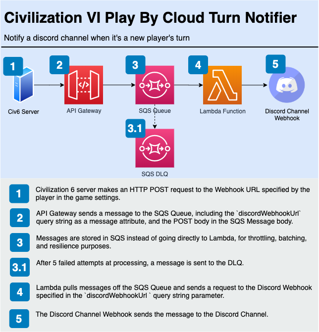
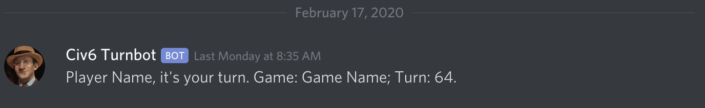

Back in the 90s, my Grandma purchased a used PC that came loaded with a few games for us kids. One of those games was <a href="https://en.wikipedia.org/wiki/Police_Quest" target="_blank">Police Quest</a>, which was my first introduction to typing commands into a computer. But the game that stood the test of time was <a href="https://civilization.com/" target="_blank">Sid Meier's Civilization</a>.

Admittedly, I had no idea how to play Civ at that young age, and I mostly played it as a city builder. I loved seeing those 8-bit animations whenever I completed a World Wonder.

I've played every Civilization release since, and while I'm not particularly good at the game, I was able to finally claim victory on the hardest difficulty. I spawned right next to another Civ and took their Settler before they could found a city... Sorry Australia. Still counts.

In this series of articles, we'll build a service to enhance the player experience in Civilization VI's "Play by Cloud" mode. You can find <a href="https://github.com/brettstack/civ6-play-by-cloud-turn-notifier" target="_blank">the source code for the entire service on GitHub</a>.

## Civilization VI, Play by Cloud, and Webhooks

Civilization VI comes with a new way to play online called Play by Cloud. PBC lets you play with multiple people without requiring them to all be online at the same time. Simply take your turn, and log off. This is great for those of us who have difficulty finding the time to sit down and play hours of video games (and Civ takes many, many hours).

Instead of a single epic session (or even several multi-hour sessions), the game can now be broken up into hundreds of micro-sessions taking just a few minutes each. Certainly the game may take a year to complete, but there's also something unique about having a long-running experience like that with friends.

To help Play by Cloud games move along at a steady pace, Civilization 6 comes with a Webhook feature. If you configure this webhook, Civ VI will send a request to the specified URL every time a player ends their turn. This allows you to write some software to then notify players that it's their turn, for example via Email, <a href="https://discordapp.com/" target="_blank">Discord</a>, <a href="https://slack.com/" target="_blank">Slack</a>, or <a href="https://flypigeon.co/" target="_blank">carrier pigeon</a>.

When I was looking into how players are using this, I found some were using <a href="https://ifttt.com/" target="_blank">If This Then That</a> to pipe the notification through to Discord. I love IFTTT, however, it doesn't have the lowest barrier of entry for non-technical people. We can do better.

## Defining an MVP; Start with the customer, and work backwards

I decided to keep the MVP focused on solving the barrier of entry problem, and limiting notifications to Discord only. While working at Amazon, one of my favorite processes was <a href="https://www.forbes.com/sites/innovatorsdna/2017/08/08/how-does-amazon-stay-at-day-one" target="_blank">Start with the customer, and work backwards</a>, so I started by thinking through what the ideal customer journey would look like.

First, we need a way to programatically send messages to a Discord channel. Discord provides its own Webhook feature for just this purpose, so the player needs to <a href="https://support.discordapp.com/hc/en-us/articles/228383668-Intro-to-Webhooks" target="_blank">create a Discord Channel Webhook</a>. Thankfully, this is accomplished in a few clicks and results in the Discord UI presenting you with a Webhook URL.

To configure the Play by Cloud Webhook, the player needs to enter a URL into the Civ VI game settings. Ideally, we would simply paste in a Discord Channel Webhook URL and be done with it, but as these two systems weren't set up to talk to eachother directly, we need an intermediary service.

Since lowering the barrier of entry is a requirement, players shouldn't be forced to register and sign in to use this service, so the intermediary service needs a public interface (specifically, a public URL/endpoint). I decided on the `civ.halfstack.software` subdomain, reusing an existing domain for this project, and I started crafting the URL that the player would need to enter into the Civ VI game settings.

Inspecting the Discord Channel Webhook URL (example: `https://discordapp.com/api/webhooks/658762929466762255/tR_-O9REJ4mwE4XGlNvFuZ3JnsE-JKePKtuhXlMb3DVG1rkh004Y5--87ArBtEWR77ys`), we can see it includes two variables - an ID and a Token. The player would need to copy the ID and Token from the Discord Channel Webhook, and paste them into this URL template `https://civ.halfstack.software?discordWebhookId=DISCORD_WEBHOOK_ID&discordWebhookToken=DISCORD_WEBHOOK_TOKEN`. Simple, right?

While I'm sure most people would be able to accomplish this incredible feat, a better customer experience would let them simply copy and paste the whole URL. The engineer in me told me to parameterize those values, but there's no value in doing this other than having a shorter, prettier, URL. Users won't care about that. So the final URL looks like `https://civ.halfstack.software?discordWebhook=DISCORD_WEBHOOK_URL`.

To recap, the player needs to:

1. Create a Discord Channel and invite players (optional if they're using an existing one)
2. Open the Discord Channel Settings and create a Webhook
3. Copy the Discord Channel Webhook URL and paste it to the end of this URL `https://civ.halfstack.software?discordWebhook=DISCORD_WEBHOOK_URL`, and paste that final URL into the Civ VI game settings

This would satisfy the MVP requirements of a low barrier of entry and notifying a Discord channel when a player ends their turn.

> A note on security: The Discord Webhook URL contains "sensitive data". That is, if someone obtained it they'd be able to use it to send messages to the channel. A future version could improve this.

## Creating a Serverless Asynchronous HTTP API

Now that we have our MVP outlined and interface defined, it's time to put the plan into action. Since Civilization VI doesn't care about the response from the webhook request, I decided to implement this service as an Asynchronous HTTP/REST API. If you're not familiar with this term, it's an API that logs a job in a system and responds to the client before the processing of that job is complete.

Here's the complete service architecture for the MVP:



And here's that service architecture defined in <a href="https://serverless.com/" target="_blank">Serverless Framework</a> (you can find <a href="https://github.com/brettstack/civ6-play-by-cloud-turn-notifier/blob/master/packages/webhook/serverless.yml" target="_blank">the source on Github</a>):

```yaml
service: civ6-pbc
provider:
  name: aws
  runtime: nodejs12.x
  memorySize: 128
  timeout: 6
  stage: ${{opt:stage, self:custom.defaultStage}}
  profile: ${{self:custom.profiles.${{self:provider.stage}}}}
  region: us-east-1
  variableSyntax: "\\${{([ ~:a-zA-Z0-9._@\\'\",\\-\\/\\(\\)]+?)}}"
  iamRoleStatements:
    - Effect: Allow
      Action:
        - sqs:SendMessage
      Resource: !GetAtt WebhookSqsQueueDlq.Arn

plugins:
  - serverless-offline
  - serverless-apigateway-service-proxy
  - serverless-domain-manager

custom:
  defaultStage: prod
  profiles:
    dev: civ6_dev
    stage: civ6_stage
    prod: civ6_prod
  apiGatewayServiceProxies:
    - sqs:
        path: /
        method: post
        queueName: !GetAtt WebhookSqsQueue.QueueName
        requestParameters:
          integration.request.querystring.MessageAttribute.1.Name: "'discordWebhook'"
          integration.request.querystring.MessageAttribute.1.Value.StringValue: method.request.querystring.discordWebhook
          integration.request.querystring.MessageAttribute.1.Value.DataType: "'String'"
  domain:
    dev:
      domain: civ.halfstack.software
      validationDomain: halfstack.software
      enabled: false
    stage:
      domain: staging.civ.halfstack.software
      validationDomain: halfstack.software
      enabled: true
    prod:
      domain: civ.halfstack.software
      validationDomain: halfstack.software
      enabled: true
  customDomain:
    domainName: ${{self:custom.domain.${{opt:stage, self:provider.stage}}.domain}}
    certificateName: '*.civ.halfstack.software'
    enabled: ${{self:custom.domain.${{opt:stage, self:provider.stage}}.enabled}}
    createRoute53Record: false

functions:
  webhook:
    reservedConcurrency: 1
    handler: handler.webhookHandler
    events:
      - sqs:
          arn: !GetAtt WebhookSqsQueue.Arn

resources:
  Conditions:
    UseDomainName:
      !Equals
        - ${{self:custom.customDomain.enabled}}
        - true
  
  Resources:
    # NOTE: Following guidance here to reduce the chance of Lambda throttling
    # https://medium.com/@zaccharles/lambda-concurrency-limits-and-sqs-triggers-dont-mix-well-sometimes-eb23d90122e0
    WebhookSqsQueue:
      Type: AWS::SQS::Queue
      Properties:
        VisibilityTimeout: 36 # functions.webhook.timeout * 6
        RedrivePolicy:
          deadLetterTargetArn: !GetAtt WebhookSqsQueueDlq.Arn
          maxReceiveCount: 5

    WebhookSqsQueueDlq:
      Type: AWS::SQS::Queue
    
    ApiGatewayMethodPost:
      Type: AWS::ApiGateway::Method
      Properties:
        RequestParameters:
          method.request.querystring.discordWebhook: true
        Integration:
          IntegrationResponses:
            - StatusCode: 200
              ResponseTemplates:
                application/json: '{}'

    AcmCertificate:
      Type: AWS::CertificateManager::Certificate
      Condition: UseDomainName
      Properties:
        DomainName: '*.${{self:custom.customDomain.domainName}}'
        SubjectAlternativeNames:
          - ${{self:custom.customDomain.domainName}}
        DomainValidationOptions:
          - DomainName: '*.${{self:custom.customDomain.domainName}}'
            ValidationDomain: ${{self:custom.domain.${{self:provider.stage}}.validationDomain}}
          - DomainName: ${{self:custom.customDomain.domainName}}
            ValidationDomain: ${{self:custom.domain.${{self:provider.stage}}.validationDomain}}
```

Civilization VI makes a request to our <a href="https://aws.amazon.com/api-gateway/" target="_blank">Amazon API Gateway</a> endpoint, which performs some transformations on the request and sends a message to an <a href="https://aws.amazon.com/sqs/" target="_blank">SQS Queue</a>. That queue is configured to send messages to a DLQ if a message failes to be processed for the 5th time.

> Adding SQS brings additional control and resiliency over going directly from API Gateway to Lambda. Another alternative solution is going directly from API Gateway to the Discord Webhook (the "no code" approach) using API Gateway's HTTP integration endpoint with VTL transformation, but <a href="https://twitter.com/AWSbrett/status/1231260929825787905" target="_blank">this approach isn't flexible for when requirements change</a>.

A <a href="https://aws.amazon.com/lambda/" target="_blank">Lambda Function</a> is configured to pull messages off the queue and send requests to the Discord Webhook. It receives batches of up to 10 messages at once, and it's configured with the <a href="https://www.npmjs.com/package/@middy/sqs-partial-batch-failure" target="_blank">@middy/sqs-partial-batch-failure</a> middleware package to easily [handle partial batch failures](/gracefully-handling-lambda-sqs-partial-batch-failures). The <a href="https://docs.aws.amazon.com/lambda/latest/dg/configuration-concurrency.html#configuration-concurrency-reserved" target="_blank">reserved concurrency</a> is set to one to add <a href="https://medium.com/@jayphelps/backpressure-explained-the-flow-of-data-through-software-2350b3e77ce7" target="_blank">backpressure</a> to the public API, which will help protect the rest of our system as it grows.

Here's a simplified section of the Lambda function that takes data from an individual SQS message and makes an HTTP request to the Discord Channel Webhook.

```javascript
async function processMessage(record, index) {
  const {
    messageId,
    body,
    messageAttributes,
  } = record

  const bodyJson = JSON.parse(body)

  const {
    discordWebhook,
    botUsername,
    avatarUrl,
    messageTemplate,
  } = getMessageAttributeStringValues({ messageAttributes })

  const {
    value1: gameName,
    value2: playerName,
    value3: turnNumber,
  } = bodyJson

  const message = getMessageFromTemplate({
    messageTemplate,
    gameName,
    playerName,
    turnNumber,
  })

  const targetWebhookBody = {
    username: botUsername,
    avatar_url: avatarUrl,
    content: message,
  }

  const response = await fetch(discordWebhook, {
    body: JSON.stringify(targetWebhookBody),
    method: 'POST',
    headers: { 'Content-Type': 'application/json' },
  })

  const responseText = await response.text()

  if (!response.ok) {
    throw new Error(`HTTP response not ok: ${response.status} ${responseText}`)
  }

  return responseText
}
```

Finally, the Discord Webhook receives the request, and a message is posted to the channel:



> You can find <a href="https://github.com/brettstack/civ6-play-by-cloud-turn-notifier" target="_blank">the source code for the entire service on GitHub</a>.

## Future enhancements

1. Map Civ VI player names to Discord usernames for @ notifying
2. Add a rotation of messages to make the notifications more dynamic.
3. Add a rotation of Civ VI memes to make the notifications more fun!
4. Track data to see who's taking the longest to take their turn